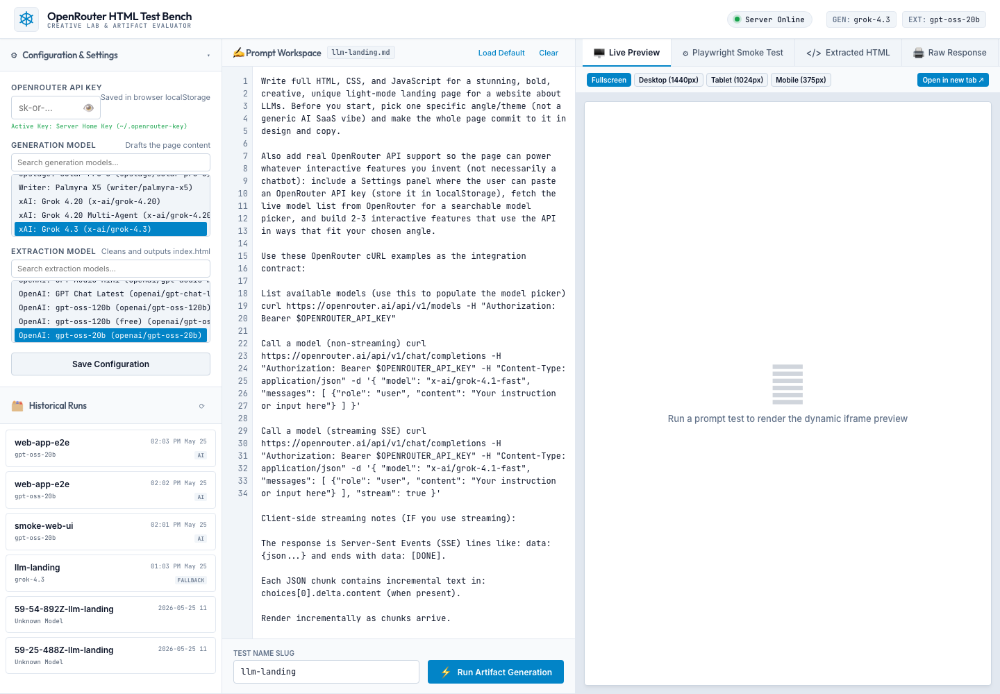

# OpenRouter HTML Test Bench

Prompt-to-HTML workbench for people who want a usable artifact, not just a raw model response.



## Why This Exists

Most model-to-HTML experiments break in boring ways: extra commentary, malformed output, blank renders, or runtime errors you do not catch until later.

This project keeps the loop tight:

- write or tweak a prompt
- generate with a stronger model
- extract the final HTML with a cheaper cleanup model
- render it locally with Playwright
- inspect the HTML, raw response, screenshot, and smoke metrics in one place

## At A Glance

- Generate HTML with one model and clean it with another
- Inspect the final page, extracted code, raw response, and smoke-test output side by side
- Re-run the same prompt from the UI or CLI while swapping models as needed

## What You Get

- Local web UI for running prompt-to-HTML tests
- Live OpenRouter model picker
- Browser-stored API key with optional server-side fallback
- Historical run viewer with extracted HTML, raw output, and screenshot
- CLI flow for scripted prompt runs
- Playwright smoke check that catches sparse/broken renders

## Quick Start

```sh
npm install
cp .env.example .env
npm start
```

Open [http://127.0.0.1:3000](http://127.0.0.1:3000).

Set either:

- `OPENROUTER_API_KEY` in `.env`, or
- `OPENROUTER_API_KEY_FILE` pointing to a text file that contains the key, or
- paste a key into the app settings panel

## CLI Usage

Run the included landing-page prompt:

```sh
npm run run:llm-landing
```

Optional model overrides:

```sh
OPENROUTER_GENERATION_MODEL="x-ai/grok-4.1-fast" \
OPENROUTER_EXTRACT_MODEL="openai/gpt-oss-20b" \
npm run run:llm-landing
```

Outputs are written to `runs/<timestamp>-<prompt-name>/`.

## Environment

```env
PORT=3000
OPENROUTER_API_KEY=
OPENROUTER_API_KEY_FILE=
OPENROUTER_GENERATION_MODEL=x-ai/grok-4.1-fast
OPENROUTER_EXTRACT_MODEL=openai/gpt-oss-20b
```

## Security And Privacy

- The app is local-first by design.
- API keys can live in `.env`, a local key file, or the browser settings panel on your machine.
- Generated artifacts and raw responses can contain prompt output you may not want to commit. Review `runs/` before sharing any test outputs.
- This repo does not ship with API keys, saved runs, or browser state.

## Notes

- The default screenshot shows the real local UI, not a mockup.
- The included `render-smoke.mjs` check writes a screenshot and JSON summary next to the HTML file you validate.
